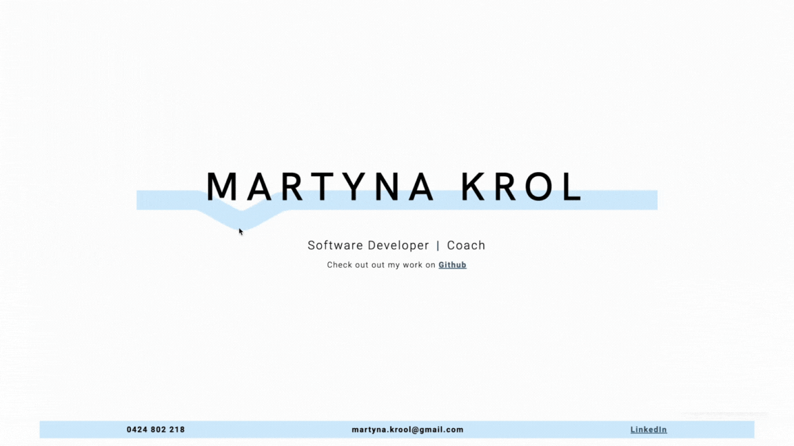

# Portfolio 2024

Check out the live page [here](http://martynakrol.me/)

This project is my updated portfolio. Although I do feel a little sentimental about my [first ever software developer portfolio](https://martynakr.github.io/portfolio/) and I still like the design of it, after almost 3 years of working as a dev it's time for a new one.

## Design Idea

I wanted to keep it simple and minimalistic, but at the same time I wanted it to be interesting. I decided to add an interactive element created with canvas that the user can play with

### Change log

-   **1 June 2024** - setting up a landing page which links to Github. The main focus for today was getting an understanding of how to work with the HTML canvas element as well as exploring and researching the math logic for bending the line in response to move movements.

-   **2 June 2024** - Made the canvas element responsive
